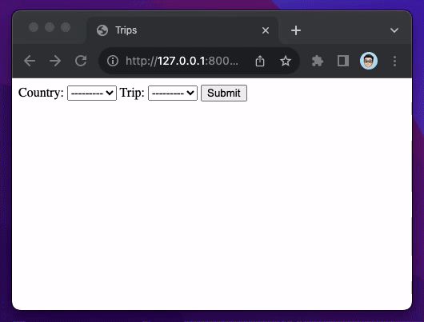
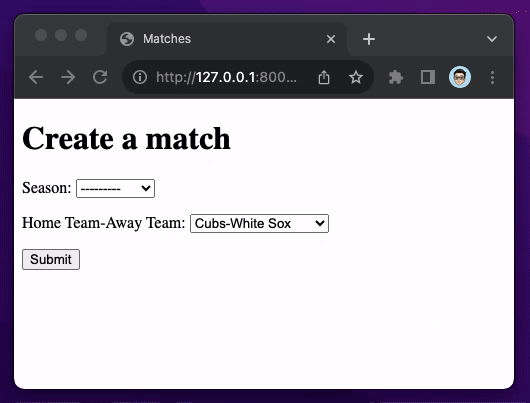

# Droppy

## Trips demo

Proof of concept of "chained" or "dependent drop-downs," i.e. multiple `<select>`s whose `<option>`s are contingent upon the previous `<select>` choice. Uses the [htmx](https://htmx.org/) library.

Original [Reddit question](https://www.reddit.com/r/django/comments/15hm8rk/dependent_dropdown_with_django_forms_what_to_use/).

Also see "[How to Implement Dependent/Chained Dropdown List with Django](https://simpleisbetterthancomplex.com/tutorial/2018/01/29/how-to-implement-dependent-or-chained-dropdown-list-with-django.html)".

## Matches demo

Proof of concept of combining two model fields into one `<select>` using [`permutations`](https://docs.python.org/3/library/itertools.html#itertools.permutations) in the [`itertools`](https://docs.python.org/3/library/itertools.html) module of the standard library.

Original [Reddit question](https://www.reddit.com/r/django/comments/15nz0ir/in_django_how_to_use_a_models_function_as_if_it/).
