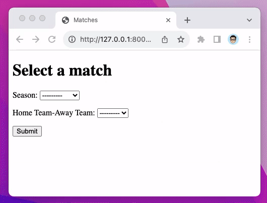

# Droppy

Proof of concept of "chained" or "dependent drop-downs," i.e. multiple `<select>`s whose `<option>`s are contingent upon the previous `<select>` choice and combining two model fields into one `<select>`. Uses the [htmx](https://htmx.org/) library.

Original Reddit questions:

- [Dependent dropdown with Django forms. What to use? How to do?
](https://www.reddit.com/r/django/comments/15hm8rk/dependent_dropdown_with_django_forms_what_to_use/)
- [In Django how to use a models function as if it is a field inside forms.py?
](https://www.reddit.com/r/django/comments/15nz0ir/in_django_how_to_use_a_models_function_as_if_it/)

Also see "[How to Implement Dependent/Chained Dropdown List with Django](https://simpleisbetterthancomplex.com/tutorial/2018/01/29/how-to-implement-dependent-or-chained-dropdown-list-with-django.html)."
